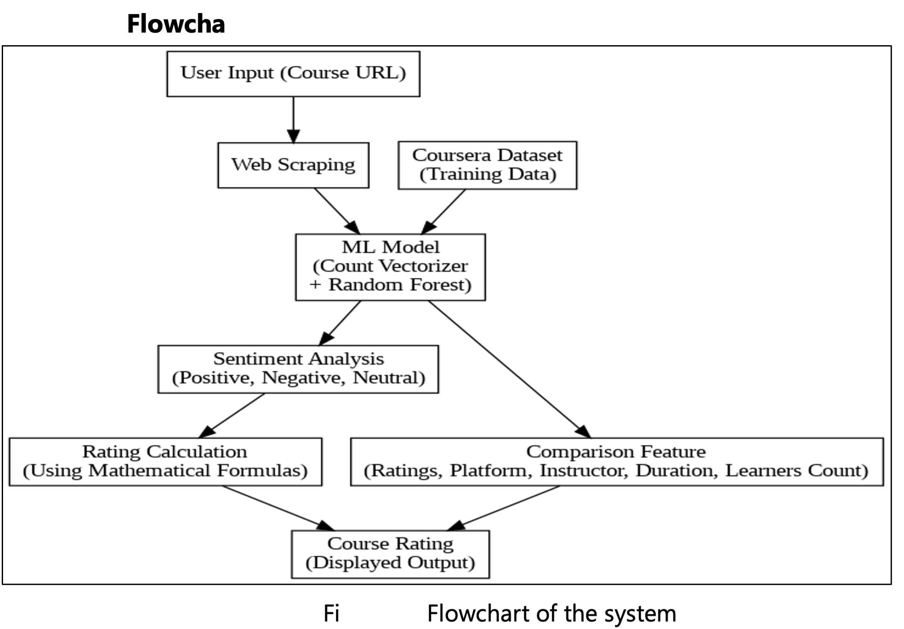
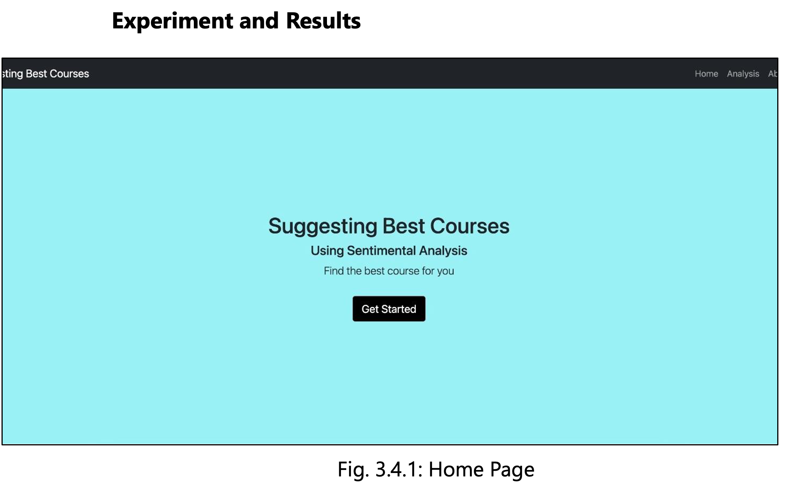
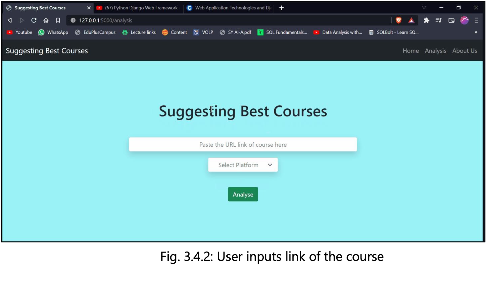
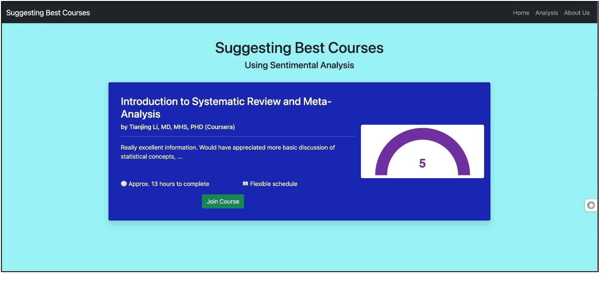
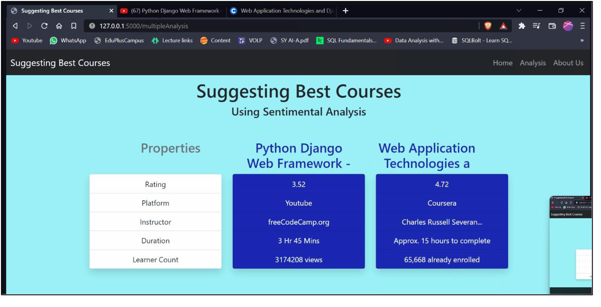

# Sentiment Analysis - Course Recommendation

## Description

The "Sentiment Analysis for Course Recommendation" project leverages web scraping and a robust machine learning model, featuring a Random Forest Classifier trained on the Coursera dataset, to assess courses based on user comments and sentiments, offering a more nuanced rating system beyond conventional star ratings. Users simply input the URL of a course they wish to evaluate, and the system extracts and classifies comments as positive, negative, or neutral. The resultant course rating is computed from these sentiments, facilitating informed decision-making for prospective learners. Additionally, the application offers course comparison functionality, allowing users to evaluate courses based on diverse criteria. This innovative approach, built with Python, Flask, and the YouTube API, empowers individuals to make education choices tailored to their specific needs and preferences, enhancing the online learning experience.

## Technology stack

1. Python Flask
2. beautiful Soup
3. Pandas
4. Youtube API

## Flowchart

## Here is performance of the model -

## Working

|  |  |  |  |
| :---------------------------: | :------------------------------: | :-------------------------------: | :------------------------------------: |
|           HomePage            |           Input Course           |         Course Sentiment          |            Compare courses             |
